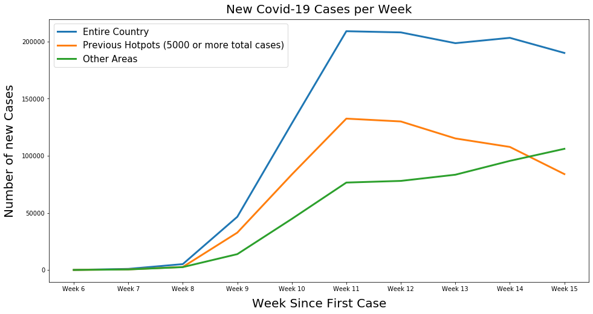

# Predicting at Risk U.S. Counties
The aim of this project was to predict which U.S. counties were at risk for a further increase in covid-19 cases
after the beginning of the first wave in March-April.

## Blog
A more fun and visually stimulating description of this project can be found on my blog on [medium](https://medium.com/@darien.pmt/metis-weeks-4-6-8bcf6c95ef3b).

# The Data
Data for this project was taken from a variety of sources. Covid-19 cases & deaths data was from the CDC. Demographic data was
from the US census. Hospital data was from Johns Hopkins' in depth [real-time analysis](https://coronavirus.jhu.edu/us-map)  
of the pandemic. Other, less significant data sources were incorportated as well (such as a dataset determine which US counties
are coastal or not). All of the raw data is available in this repo.

# Determining the Target
It goes without saying that there was no predetermined label for if a county was at risk or not, so I had to define my own
criteria. A US county was defined to be at risk of if it safisfied the following:

1. At least 150 cases while observing at least one week of a 50% increase.
2. At least 100 cases while observing at least one week of a 75% increase.
3. At least 50 cases while observing at least one week of a 100% increase.

I did not want to label a county at risk if they saw an increase in cases from 2 to 8. On the other hand, a 40% weekly 
increase in cases would be quite bad in NYC, but we already know the conditions are bad there, so we wouldn’t be learning 
anything new.

Code for determining the target can be found in `covid_features_and_target.ipynb`.

# Modeling
A variety of classification models were fit to the data, the most successful being Random Forest. 

## Class Imbalance
Only 4.5% of US counties were labeled to be at risk for further outbreak, so I oversample my training data to acount for this,
yielding better results.

## Parameter Tuning and Optimal Threshold
A grid search was run on on the RF model to find parameters that optimized F1. I adjusted the theshold on my find model as 
opposed to using the default 0.5.

## Results
Of the counties which were acutally at risk, the model predicted 64% of them correctly. 
An interactive map of the results can be seen on my Tableau public [profile](https://public.tableau.com/profile/darien2928#!/vizhome/CountiesliketoseeincreaseinCovid-19Cases/Dashboard1).

# Conclusion
By examining the map of my results, I noticed that areas most at risk seemed to be surrounding the areas previously hit hard 
(NYC, LA, CHI etc). I decided to remove counties which had total case counts over 5000 and plot their weekly increase cases.
The results were interesting.

